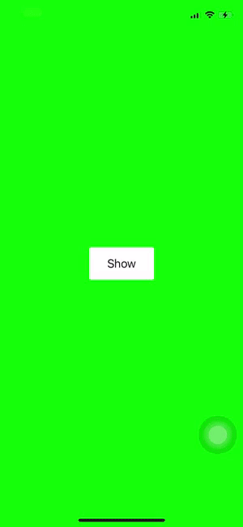
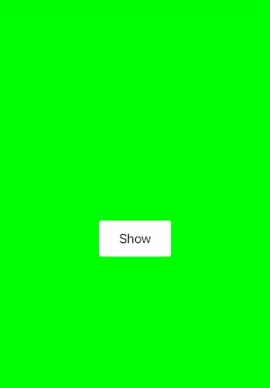

[](https://cocoapods.org/pods/MNkAlertView)
[](https://cocoapods.org/pods/MNkAlertView)
[](https://cocoapods.org/pods/MNkAlertView)

If you want to create a custom alert view precisely of the design handoff, you can get help from the MNKAlertView framework.
<br>

## Installation

### CocoaPods
[CocoaPods](https://cocoapods.org) is a dependency manager for Cocoa projects. You can install it with the following command:

```ruby
$ gem install cocoapods
```
To integrate MNkAlertView into your Xcode project using CocoaPods, specify it in your Podfile:

```ruby
source 'https://github.com/CocoaPods/Specs.git'
platform :ios, '12.0'
use_frameworks!

target '<Your Target Name>' do
    pod 'MNkAlertView', '~> 1.0.0'
end
```
Then, run the following command:
```ruby
$ pod install
```

### Swift Package Manager

[Swift Package Manager](https://swift.org/package-manager/) is a tool for managing the distribution of Swift code. It’s integrated with the Swift build system to automate the process of downloading, compiling, and linking dependencies.

> Xcode 11+ is required to build MNkAlertView using Swift Package Manager.

```Swift
dependencies: [
    .package(url: "https://github.com/MnkGitBox/MNkAlertView.git", .upToNextMajor(from: "1.0.0"))
]
```

### Manually

If you prefer not to use either of the aforementioned dependency managers, you can integrate MNkAlertView into your project manually.

---

## Usage
### **Show Simple Alert**



You can build this simple alert view comes with the library by runnig below code.

```Swift 
func showAlert() {
        let alertView = MNkAlertView()
        alertView.titleLabel.text = "Confirm"
        alertView.messageLabel.text = "Do you want to proceed with these settings?"
        alertView.type = .multi
        
        let alertController = MNkAlertViewController()
        alertController.set(alertView: alertView)
        self.showAlert(of: alertController, aditional: nil)
}
```

### **Build More Customized Alert**
If your UI design element doesn't match with the UI element that comes with the library, you can create any custom alert view by subclassing the `MNkAlertView` class. 



- Create `CustomAlertView` view by subclassing the `MNkAlertView`.

```Swift
class CustomAlertView: MNkAlertView {
    private var topStripView: UIView 
    private var indicatorImageView: UIImageView 
    
    override func createViews() {
        super.createViews()
        
        mainStackView.insertArrangedSubview(indicatorImageView, at: 0)
        mainStackView.spacing = 20
        
        rightActionButton.layer.cornerRadius = 3
        rightActionButton.backgroundColor = .lightBlue
        rightActionButton.setTitleColor(.white, for: .normal)
    }
    
    override func insertAndLayoutSubviews() {
        self.addSubview(alertContainer)
        alertContainer.addSubview(mainStackView)

        ......
    }
    
    override func config() {
        backgroundColor = .clear
    }
}
```
- And call `showAlert(of:_, aditional: _)` function with the `CustomAlertView`.

```Swift 
func showCustomAlert() {
    let alertView = CustomAlertView()
    alertView.titleLabel.text = "Saved"
    alertView.messageLabel.text = "New settings save successfully."
        
    let alertController = MNkAlertViewController()
    alertController.set(alertView: alertView)
    self.showAlert(of: alertController, aditional: nil)
}
```

- You can catch button action by assign clouser type to `action` variable.

```Swift 
alertView.action = { actionType, data in
            switch actionType {
            case .rightClick:
                print("Right Action")
                
            case .leftClick:
                print("Left Action")
                
            default:
                break
            }
        }
```

## Resources

You can find the original sample code [here](SampleCode.swift).

## Credits
- Malith Nadeeshan ([malithnadeeshan](https://twitter.com/malithnadeeshan))

## License

MNkAlertView is released under the MIT license. See LICENSE for details.

